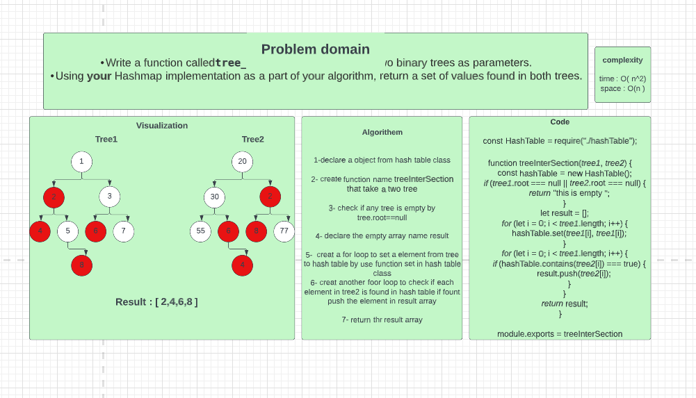
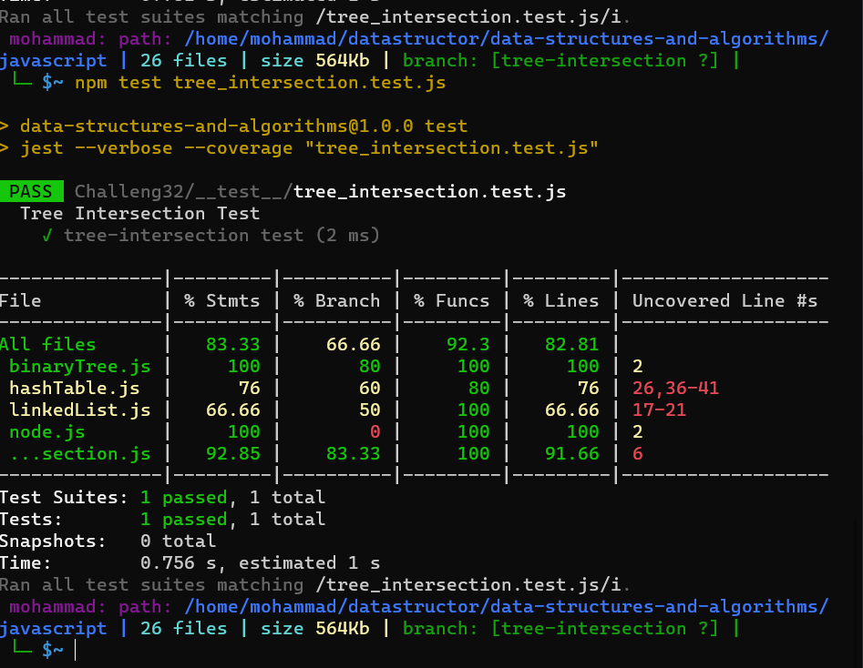

## Challenge

Write a function calledtree_intersectionthat takes two binary trees as parameters.
Using your Hashmap implementation as a part of your algorithm, return a set of values found in both trees.

## Whiteboard

## Test
