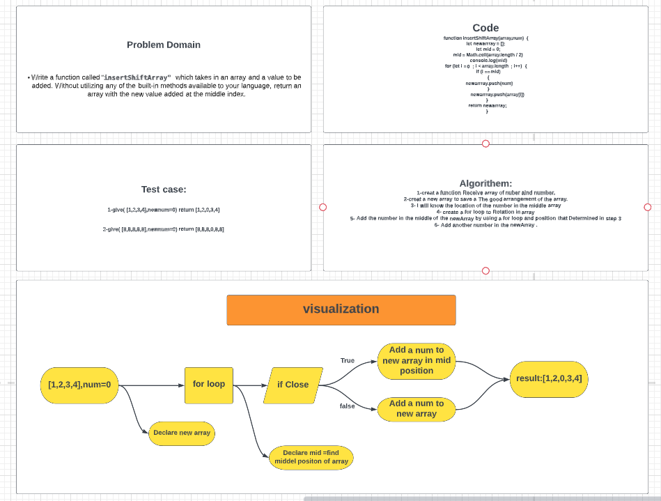

# Insert to Middle of an Array

### Insert number to Middle of an Array
Write a function called insertShiftArray which takes in an array and a value to be added.  return an array with the new value added at the middle index.
___
 

