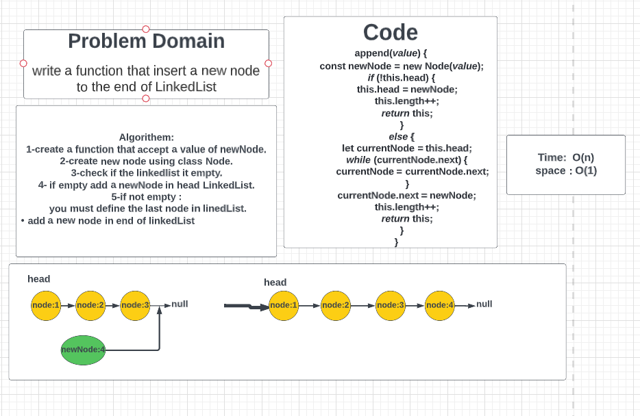
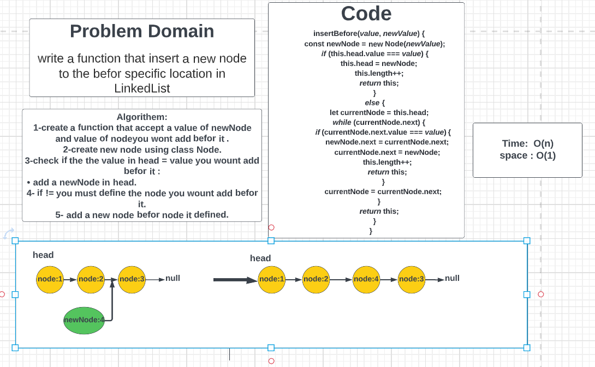
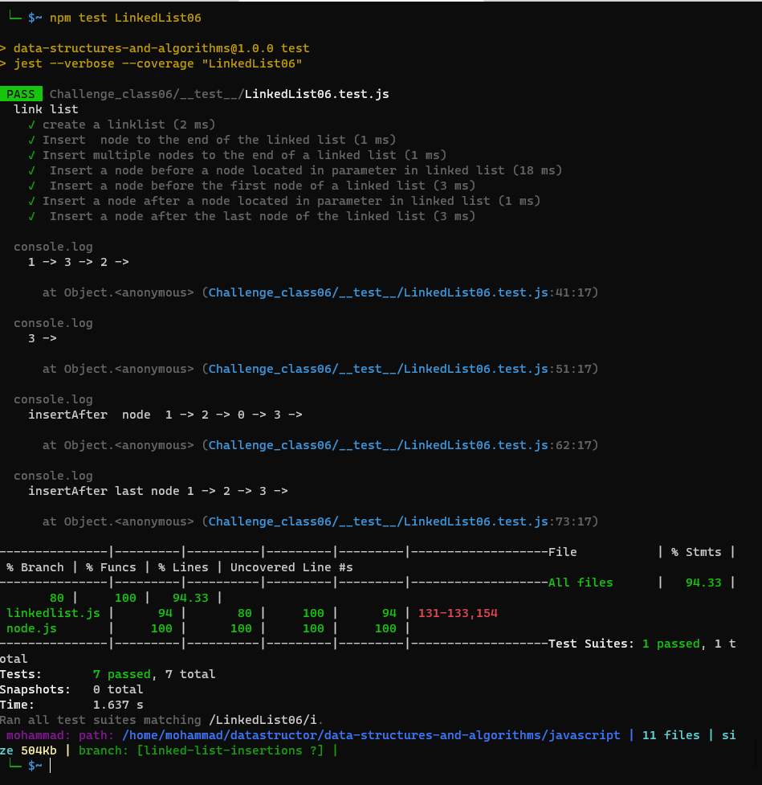

# Linked list :
### Challenge Summary:
- create a function  that insert  to LinkedList  that takes a value and add the node in end of the Linked List.

- create a function    insertBefore that take two parameter value of newNode and position of node you wont add befor it in LinkedList .
- create a function    insertAfter that take two parameter value of newNode and position of node you wont add after it in LinkedList .

___
### Whiteboard Process:
Insert node at end of LinkedList  :

Insert node befor node spicific  of LinkedList  :

___
## Testing:

