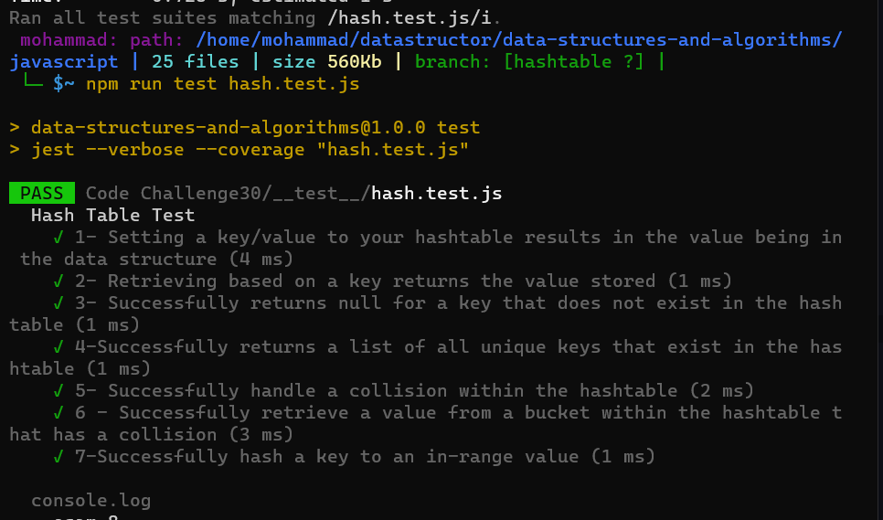

## Hashtables : 

1 - Hash - A hash is the result of some algorithm taking an incoming string and converting it into a value that could be used for either security or some other purpose. In the case of a hashtable, it is used to determine the index of the array.

2- Buckets - A bucket is what is contained in each index of the array of the hashtable. Each index is a bucket. An index could potentially contain multiple key/value pairs if a collision occurs.

3- Collisions - A collision is what happens when more than one key gets hashed to the same location of the hashtable.

____
## Hash Table Methods :
 #### set:

  - Arguments: key, value
  - Returns: nothing
  - This method should hash the key, and set the key and value pair in the table, handling collisions as needed. Should a given key already exist, replace its value from the value argument given to this method.

#### get:

- Arguments: key
- Returns: Value associated with that key in the table

#### contains: 

- Arguments: key
- Returns: Boolean, indicating if the key exists in the table already.

#### keys:

- Returns: Collection of keys
hash

- Arguments: key
Returns: Index in the collection for that key
Footer
____
## Test :

___

### Complixty : 
- Time: O(1) 

- Space: O(n) 
___