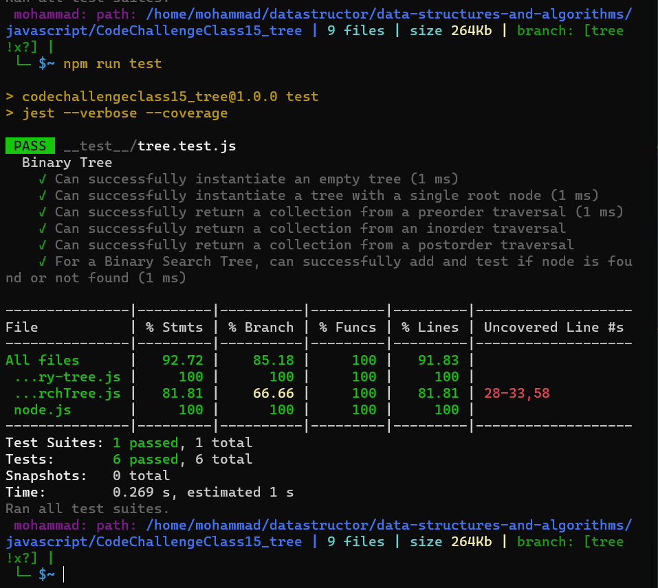

## Challenge : 

#### Node:

  - Create a Node class that has properties for the value stored in the node, the left child node, and the right child node.

#### Binary Tree:

- Create a Binary Tree class:
 
    - Define a method for each of the depth first traversals:
         
         -pre order
        
        -in order
       
       -post order 

#### Binary Search Tree:

- Create a Binary Search Tree class

- Add:
  - Arguments: value
  - Return: nothing
  - Adds a new node with that value in the correct location in the binary search tree.

- Contains
   - Argument: value
  - Returns: boolean indicating whether or not the value is in the tree at least once.

____

### API:
API
- preOrder():  >> root, left, right.
- inOrder(): >> left, root, right.
- postOrder():  >> left, right, root.
___
## Test:

