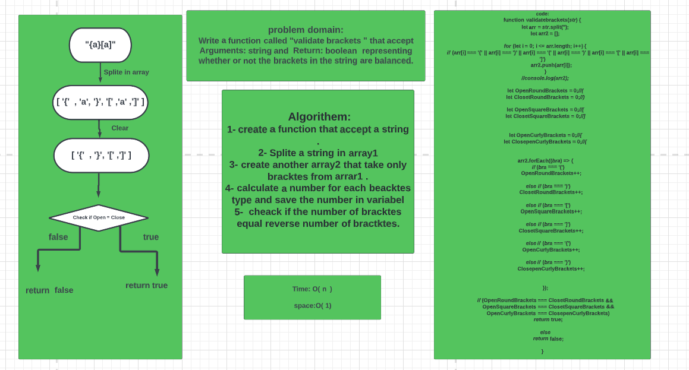
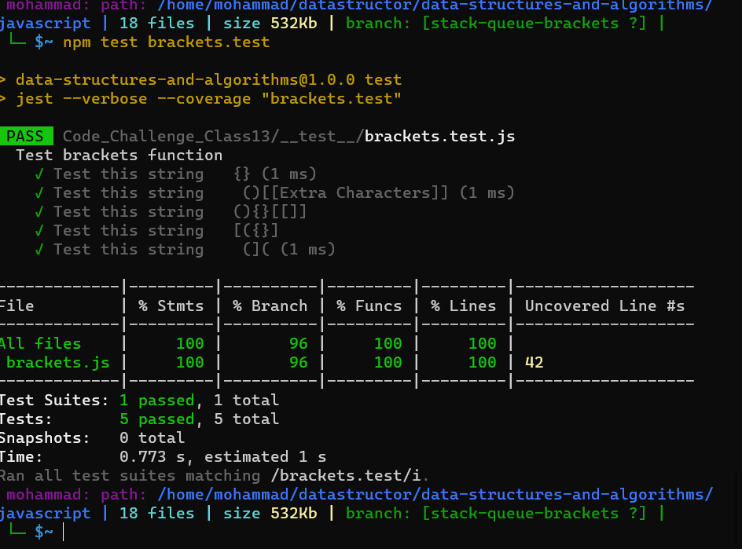

## Challenge Summary :

Write a function called "validate brackets " that accept Arguments: string and  Return: boolean  representing whether or not the brackets in the string are balanced.

___
 ## Whiteboard Process:
 
 ___
  ## Test:
 
