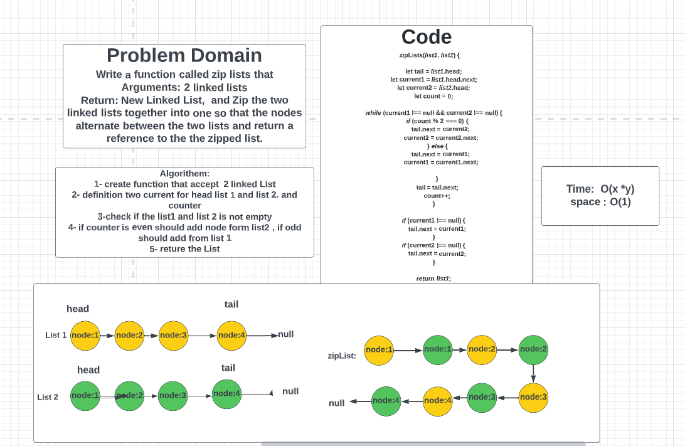
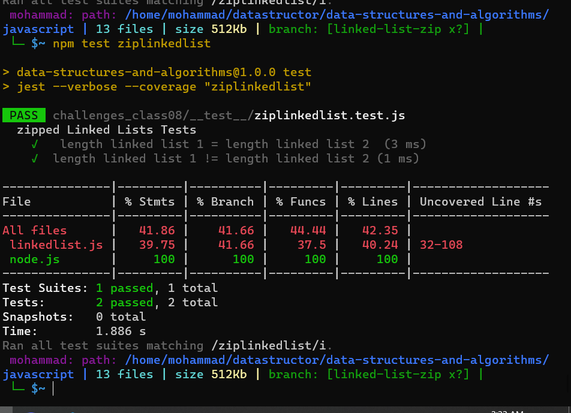

# Linked list :
### Challenge Summary:

Write a function called zip lists that Arguments: 2 linked lists
Return: New Linked List,  and Zip the two linked lists together into one so that the nodes alternate between the two lists and return a reference to the the zipped list.
___
### Whiteboard :

___
## Testing:

