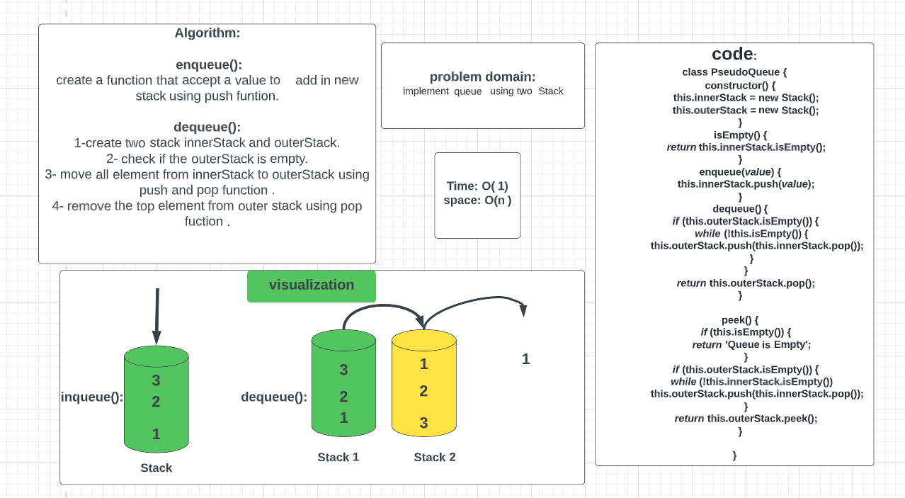
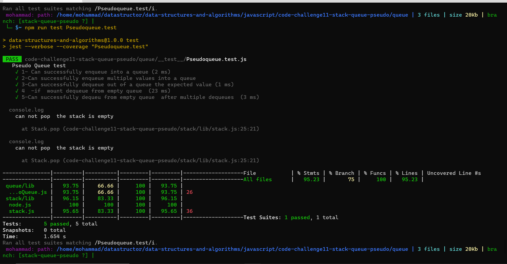

# Challenge Summary

### Implement a Queue using two Stacks
- Create a new class called pseudoqueue.

- define two new  stack . 

- create a  methods:
  - enqueue
     - Arguments: value
     - to insert a value to pseudoqueue
 
 
  - dequeue
     - Arguments: none
    - to remove a element from pseudoqueue

## Whiteboard Process

 

## Approach & Efficiency
<!-- What approach did you take? Why? What is the Big O space/time for this approach? -->

### Complexity:
 - Time Complexity:  O(1) 

 - Space Complexity: O(n)

 ## Test:
 

