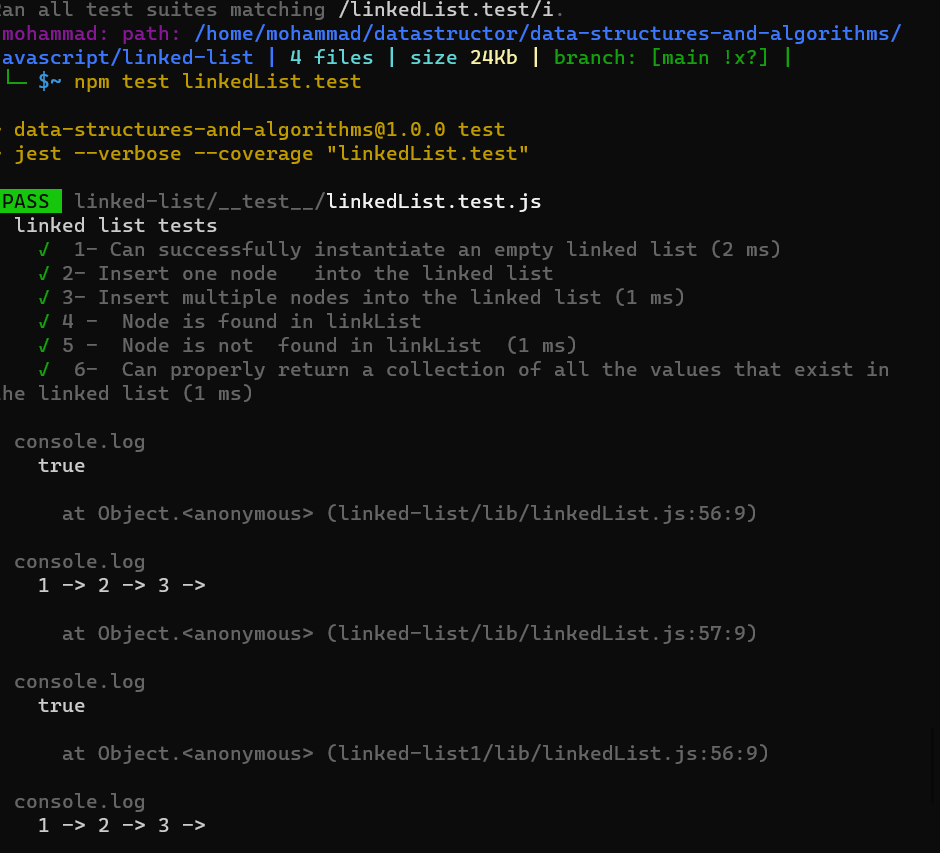

# Singly Linked List:

 - Linked List:
  is a linear data structure. Unlike arrays, linked list elements are not stored at a contiguous location; the elements are linked using pointers. 
 ___
 ## Challenge:
 - Can successfully instantiate an empty linked list
- Can properly insert into the linked list
- The head property will properly point to the first node in the linked list
- Can properly insert multiple nodes into the linked list
- Will return true when finding a value within the linked list that exists
- Will return false when searching for a value in the linked list that does not exist
- Can properly return a collection of all the values that exist in the linked list
___

## Approach & Efficiency:
I have three function :
- insert(): time: O(n) ____space:O(n)
- include(): time: O(n^2) ____space:O(1) 
- toString(): time: O(n) ____space:O(1)
___
 ## API:

 Build a linked list :
- you can add new node if the linkedList is empty.
- you can add new node if the linkedList isnot empty.
- you can serch if the node is existed or not existed.
- you can show all nodes in the linkedList in the String .
___
## Test:
 
