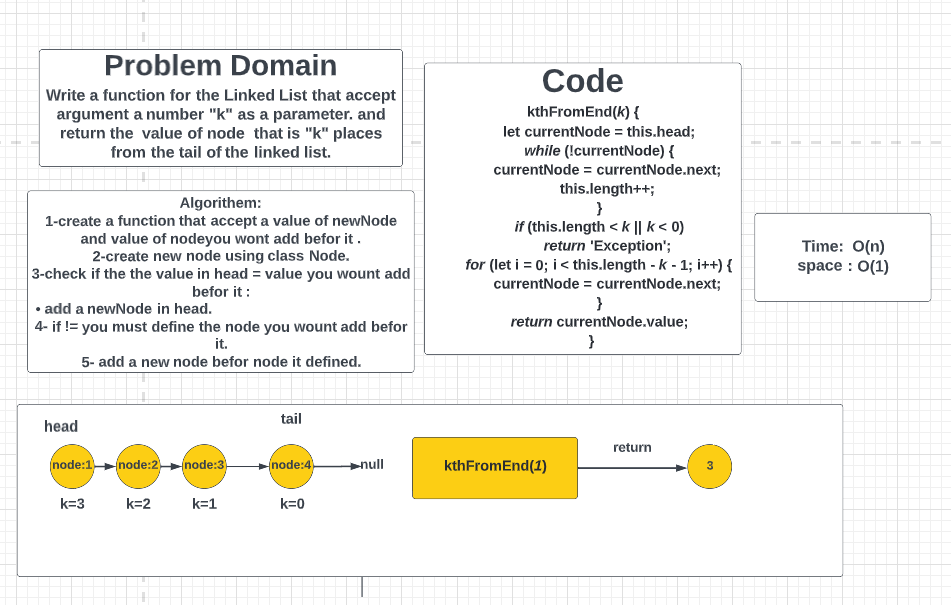
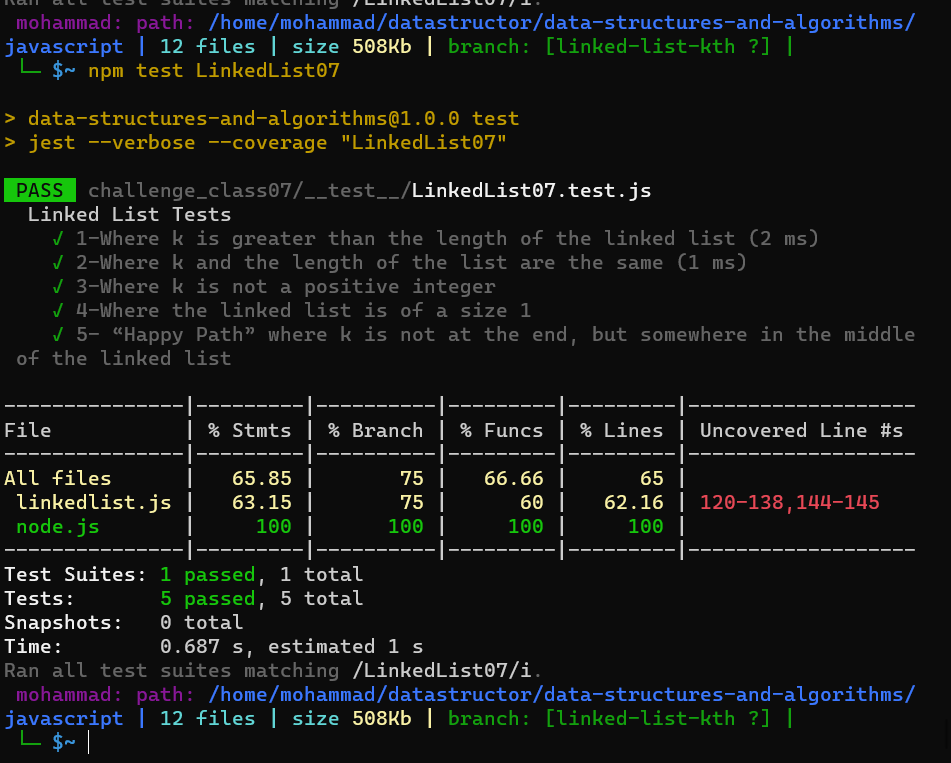

# Linked list :
### Challenge Summary:
Create a function for the Linked List that accept argument a number "k" as a parameter. and return the  value of node  that is "k" places from the tail of the linked list.

___
### Whiteboard :

___
## Testing:

